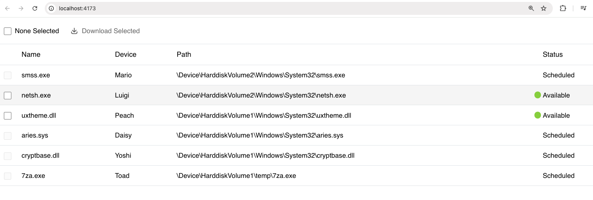

# File Table

A React-based file table built with TypeScript, styled-components, and Vite.



## 🚀 Getting Started

### Installation

```bash
npm install
```

### Development

```bash
npm run dev
```

### Testing

```bash
npm run test
```

### Production

```bash
npm run build

npm run preview
```

## 📁 Folder Structure

```
src/
├── assets/             # Static assets like images
├── components/         # Reusable UI components
│   ├── Checkbox/       # Checkbox component
│   ├── IconButton/     # Icon button component
│   ├── StatusIndicator/ # Status indicator component
│   ├── Table/          # Table component
│   └── GlobalStyles    # Global styling
├── containers/         # Complex components with business logic
│   └── FileTable/      # Main file table component
├── data/               # Mock data and constants
├── test/               # Test setup and utilities
├── theme/              # Styling constants
├── utils/              # Helper functions and utilities
├── App.tsx             # Root component
└── main.tsx            # Application entry point
```
